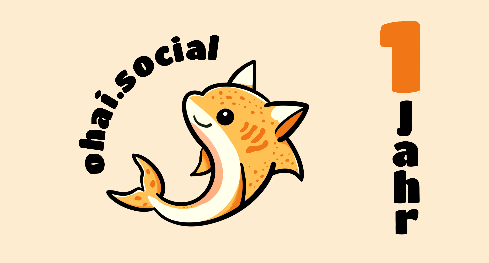

Heute ist es so weit: ohai.social wird ein ganzes Jahr alt!
Wäre dieser Server ein Mensch, könnten wir uns jetzt an andere Menschen erinnern und unsere ersten Worte brabbeln.
ohai.social hingegen sprach die ersten Worte schon im Alter von zwei Stunden ins Internet:

<iframe src="https://ohai.social/@ohai/109309770136074484/embed" class="mastodon-embed" style="max-width: 100%; border: 0; margin-top: .5rem; margin-bottom: 1.5rem;" width="400" allowfullscreen="allowfullscreen"></iframe>

Über das Jahr sind auf ohai.social über 1 Million Posts veröffentlicht und 38,000 Accounts angelegt worden. Die aktuell ca. 3,600 aktiven Nutzenden haben dabei Kontakt zu nahezu 30.000 anderen Servern aufgenommen.

Unser dreiköpfiges Moderationsteam auf zwei Kontinenten hat im ersten Jahr insgesamt 945 Reports bearbeitet -- ungefähr 78 pro Monat und 3 am Tag. Von allen bisherigen Reports wurden 14% innerhalb von 60 Sekunden, 58% in 20 Minuten und 71% innerhalb einer Stunde bearbeitet. Der Rest waren größtenteils Sonderfälle, die wir erst als Team besprochen haben.

Die Infrastruktur für den Server und das Drumherum kostet Geld. Wir hatten daher direkt im November 2022 ein Patreon-Konto angelegt und waren positiv überrascht über all eure Unterstützung!
Mittlerweile decken wir gerade so unsere laufenden Kosten und müssen nur noch die höheren Kosten vom Serverstart aufholen. All unsere laufenden Kosten und Einnahmen publizieren wir transparent auf der [Spenden](https://about.ohai.social/donations/)-Unterseite unserer Homepage.

Wenn Ihr euch auch weiterhin am Erhalt des Servers beteiligen wollt, dann unterstützt uns gerne [auf Patreon](https://www.patreon.com/ohaisocial) ❤️.

Um den Anlass angemessen zu zelebrieren dachten wir, dass es an der Zeit ist dem Server ein ordentliches Logo zu spendieren. Eine Freundin von uns hat den Katzenhai im Header als neues Servermaskottchen für uns gezeichnet. Und der nächste logische Schritt wenn man ein neues süßes Maskottchen hat ist, dass man natürlich Sticker bestellen _muss_.

Da wir die Sticker nicht nur für uns selbst horten wollen, haben wir uns Gedanken gemacht, wie wir sie am besten verteilen können. Am Ende ist die Wahl auf ein extra Mitgliedschafts-Tier in [unserem Patreon](https://www.patreon.com/ohaisocial) gefallen:

Wenn Du dich für das 15$-Tier anmeldet und eine Adresse angibt, senden wir 10 der Sticker direkt zu Dir! Die Sticker sind ca. 6x6cm und es kann bis zum Versand eine Weile dauern, weil sie erst hergestellt werden müssen. Du kannst danach deinen Monatsbeitrag wieder senken, oder ganz kündigen, und bekommst trotzdem deine Sticker, keine Angst.

Auf viele weitere schöne Jahre mit euch!

Das ohai.social Team 🍾🥂

