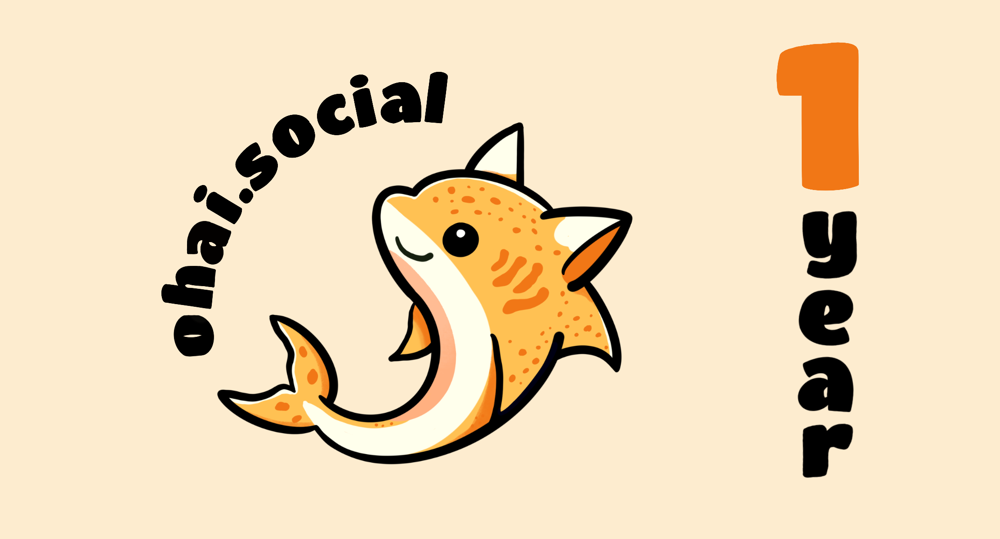

Today's the day: ohai.social is celebrating it's one-year anniversary!
If this server were a human, it could now recall other people and would speak its first words.
ohai.social's initial words on the Internet were "Hello world! 🌏 👋" at the age of just two hours:

<iframe src="https://ohai.social/@ohai/109309770136074484/embed" class="mastodon-embed" style="max-width: 100%; border: 0; margin-top: .5rem; margin-bottom: 1.5rem;" width="400" allowfullscreen="allowfullscreen"></iframe>

Over the course of the year, more than 1 million posts and 38,000 accounts have been created on ohai.social. There are currently 3,600 active users that have interacted with nearly 30,000 other servers!

Our moderation team of three people from two continents handled a total of 945 reports in the first year -- about 78 reports per month, or three per day. We were able to handle 14% of all reports within 60 seconds, 58% within 20 minutes and 71% within an hour. The rest were usually edge cases where we deliberated as a group before coming to a decision.

All of our server and surrounding infrastructure costs money. Pretty early on, we created a Patreon account for the server and were pleasantly surprised by all your support! We now just about cover our operating costs, but still have to recover the financial backlog from the initially higher costs. We also disclose all of our ongoing costs and income in the [donations](https://about.ohai.social/donations/) section of our homepage.

If you want to help maintain the server, please keep supporting us [on Patreon](https://www.patreon.com/ohaisocial) or consider signing up if you haven't yet. ❤️

To adequately celebrate the occasion, we figured it was about time our server got a proper logo. A friend of ours drew the adorable cat–⁠shark in the header as a new server mascot -- And once you have an adorable mascot, the next step obviously is that you _have_ to order stickers.

Because we don't want to just hoard the stickers for ourselves, we pondered the best way to get them to the people and ultimately settled for a special membership tier in [our Patreon](https://www.patreon.com/ohaisocial):

If you sign up for the 15$ tier and provide an address, we'll send 10 of the stickers right your way! They're approx. 6x6cm / ≈ 2.3x2.3 inch in size, and delivery might take a while because they have to be manufactured first. After the first month you can then lower or cancel your Patreon subscription, you'll still get your stickers, don't worry.

Here’s to many more wonderful years with all of you!

The ohai.social team 🍾🥂

