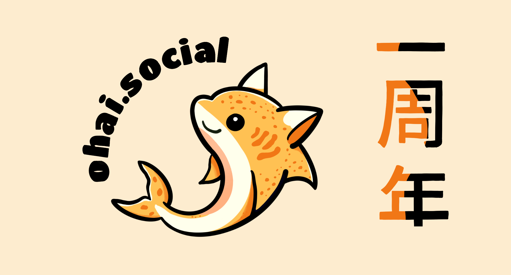

今日は記念日です：私たちは一歳の誕生日を迎えました！
もしこのサーバーが人間だったら、今頃は、生まれて初めて、最初の言葉を話す頃です。

しかし、ohai.socialはインターネット上に産まれて2時間後、初めての言葉を話しました：

<iframe src="https://ohai.social/@ohai/109309770136074484/embed" class="mastodon-embed" style="max-width: 100%; border: 0; margin-top: .5rem; margin-bottom: 1.5rem;" width="400" allowfullscreen="allowfullscreen"></iframe>

ohai.socialが誕生して以来、ohai.socialには100万以上の投稿が公開され、38,000アカウントが作成されました。3,600人のアクティブなユーザーは約30,000の他のサーバーと連絡を取り合っています。

私たちの3人の管理チームは、最初の年に合計945件のレポートを処理しました。これは月に約78件、1日に約3件です。
全レポートの14％を60秒以内に、58％を20分以内に、71％を1時間以内に処理することができました。残りは大抵エッジケースで、決断を下す前にグループで検討しました。

サーバーや関連インフラには経費がかかります。早い段階で私たちはサーバー支援のためにPatreonアカウントを開設しました。それは、皆様からのご支援による寄付のおかげでもあります。皆様からのたくさんのサポートに心から感謝しております！現在、運営コストの大部分を賄えていますが、初期の高額なコストをまだ回収中です。また、ホームページの[寄付情報](https://about.ohai.social/donations/)ページにて、継続的な経費と収益を透明に公開しています。

サーバー維持のためのご支援を検討いただける方は、[Patreon](https://www.patreon.com/ohaisocial)での継続的なご支援をお願いします。サポートしてくださっている皆様には本当に感謝しています！❤️

当プロジェクトの節目を祝うため、サーバーに適したロゴが必要だと考えました。友人がサーバーのマスコットとなる愛くるしいネコザメのイラストを描いてくれました -- そして、愛らしいマスコットが完成し、次に考えたのはステッカーの作成です。

この素敵なステッカーを私たちだけで、独り占めにするつもりはありません。皆様にどう配布するかを考えた結果、[私たちのPatreon](https://www.patreon.com/ohaisocial)の特定の支援層を対象とすることにしました：

15ドルの会員になり、住所を教えていただければ、ステッカーを10枚お送りします。サイズは約6x6cmです。製造に時間がかかるため、配送には少し時間がかかるかもしれませんが、最初の1ヶ月が経過してから、支援額を減らしたりキャンセルしたりしても、ステッカーはお届けされますのでご安心ください。

これからも皆さんと共に素敵な時を過ごせることを願っています！

ohai.socialチームより🍾🥂。

